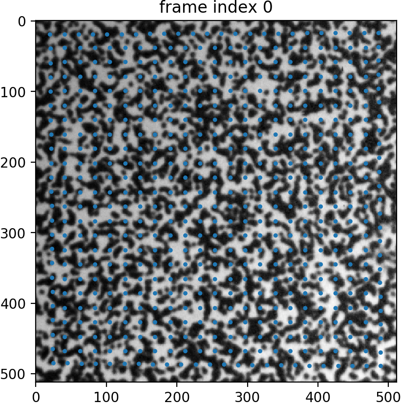
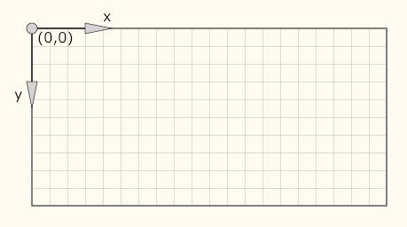
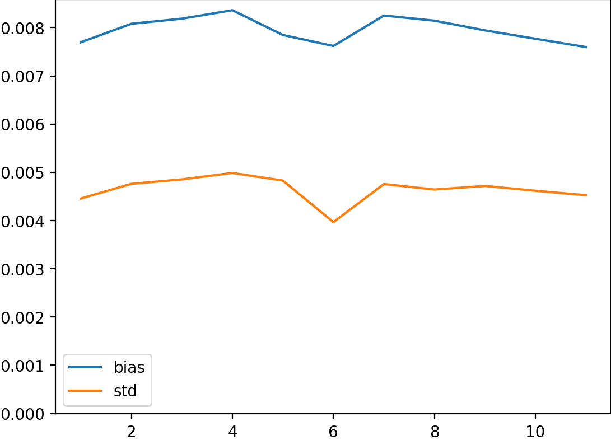
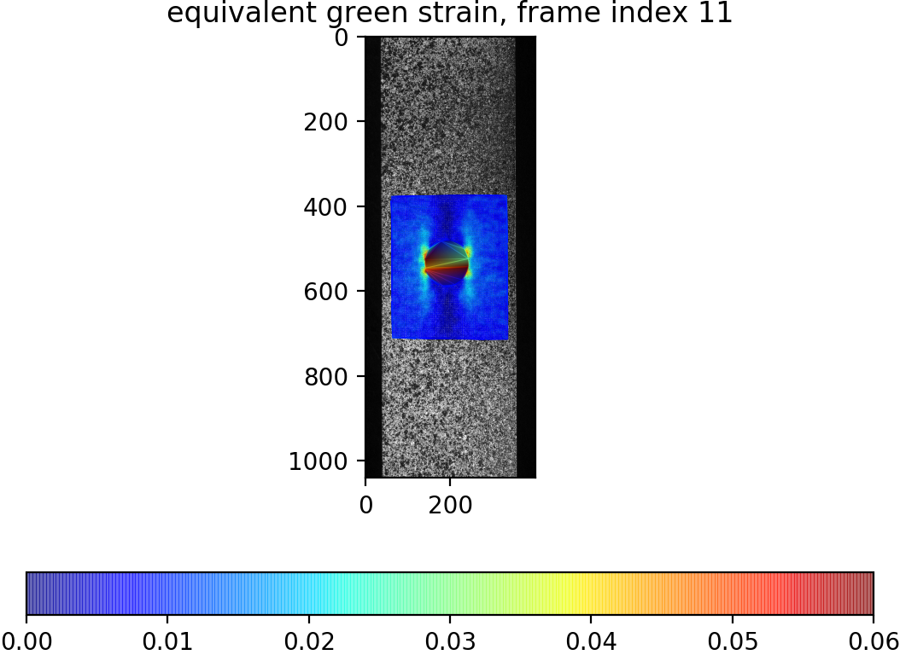
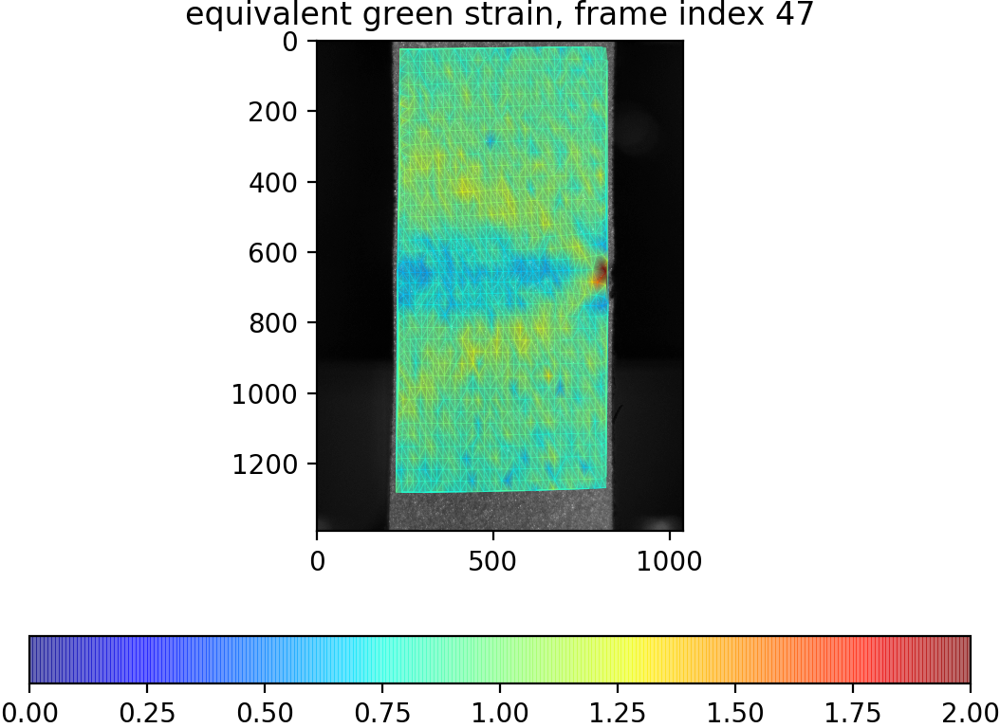
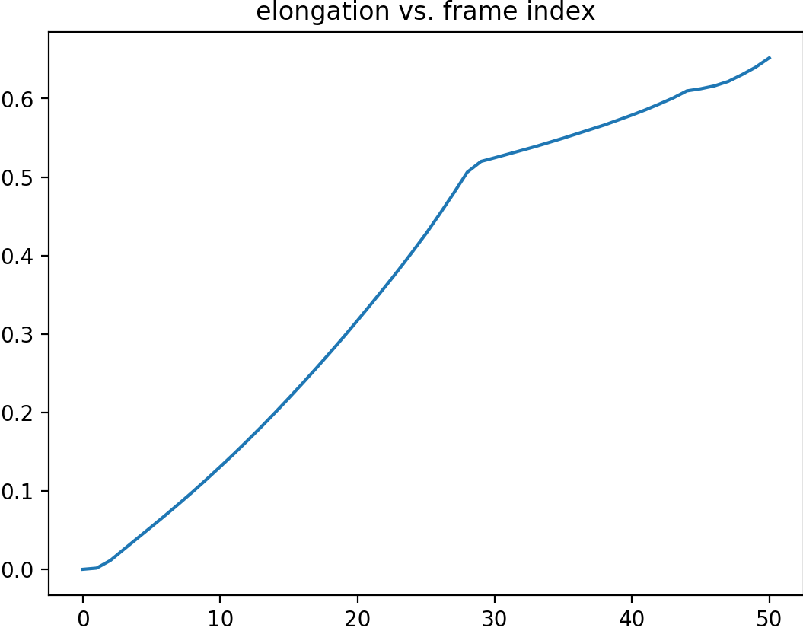
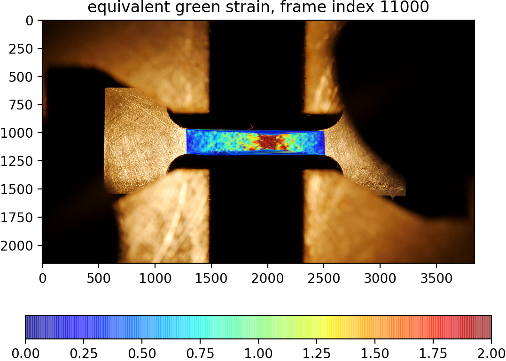

# Manual of DIC-demo

DIC-demo contains the data , source code and analysis code for Digital Image Correlation (DIC) method. This document provides the essential information to use the package. 

The features of this DIC algorithm includes:

- Automatically determines the suitable frame step to reduce the accumulated error while increase the robustness and efficiency of the analysis. 
- Automatically mark points moving out of field. 
- Utilizing GPU computation. 
- Utilizing deep learning based optical flow algorithm to get accurate and robust initial guess. 

## Background of DIC

DIC is an noncontact  optical deformation measurement method that is widely applied in the area of experimental mechanics [1-3]. Primary advantages of DIC include simple implementation, low environment requirements, and non-contact full-field measurement. 

It is related with the techniques in computer vision such as image registration and visual tracking. The most common DIC algorithm can be considered as the patch-based affine transformation image registration method. 

The goal of the DIC algorithm is to obtain displacements and strain field within the region of interest (ROI) from the video or images of the specimen in different states. For subset-based DIC, it is archived by tracking POIs, e.g. centers of subsets. Positions of POIs are known in the reference image and needed to find out deformed positions in the current image. The reference and current image usually are the undeformed and deformed image respectively. 

*POIs in the reference image*



## Source code

The core source code is located in the **lib** folder. The main file `dic.py` is imported in all analysis codes. Most functions and class are implemented in this file. 

Other files `liteflow.py`, `correlation.py`, and `network-default.pytorch` are from deep learning based optical flow package [LiteFlowNet](https://github.com/sniklaus/pytorch-liteflownet). This network is used to efficiently provide accurate initial guess for the subpixel level DIC search. 

The source code is implemented in Python and based on several scientific computing, computer vision, and utility libraries. 

- **Numpy** and **Scipy**: Basic array data structure and math operations 
- **Matplotlib**: Plotting library
- **PyTorch** and **Cupy**: Deep learning libraries are used in pixel level searching, interpolation calculation, and etc. 
- **networkx**: Provide data structure of graph

### Core concepts

**POIs** is the NumPy array that stores the coordinates of the points of interest (POIs). The shape of the array is $n\times 2$ where $n$ is the number of the POIs. The first and second column are the x and y coordinate respectively. 

**Subset** is the image patch around the POI that actually be registered. The typical shape of the subset is square. `subset_size` is the length of the side of the square subset. It is typical characterized by `subset_level` as $\textrm{subset_size}=2*\textrm{subse_level}+1$. 

**Coordinate system**. If not specified, the default coordinate system is the image coordinate system. As shown in figure, the origin is at the upper left corner. X and y axis point right and down respectively. 



**start_index**, **end_index**, **ref_index**, and **cur_index** are the frame indexes in the images that regularly refer in the analysis. **start_index** and **end_index** are the start and end frame index of the time region to be analyzed. With current implementation, **start_index** can be larger than **end_index** and the actual calculation is conducted backward. **ref_index** and **cur_index** are the reference and current frame index of the specific analysis step. 

**reader** is a class that loads the image data from various types of underling files. The position indexing `reader[n]` is provided to get the nth frame of the stream. The reader instance can be one of

- **video_loader**: Load image from the video file (avi, mp4, and so on). Parameter `video_file` is the string specifies the location of the file. Optional parameter `fps` specifies the frame rate of the video in the unit of frame per second. Default value is $30000/1001$. Property `reader.nframes` returns the number of frames of the video file. Property `reader.relative_timestamp_list` returns the list of relative time of each frame in respect the initial frame. 

- **image_folder_loader**: Load image from the image folder. It currently supports jpg, png, tiff, and npy. Parameter `image_folder` is the string specifies the location of the folder. Parameter `suffix` is the suffix of the image file. If provided optional parameter `time_format`, the time list will be inferred from the filename of the image file. Property `reader.relative_timestamp_list` returns the list of relative time of each frame in respect the initial frame. Property `reader.timestamp_list` returns the list of absolute time of each frame. Property `reader.img_files` returns the list of name of the image file. Property `reader.timestamp_list` returns the list of absolute time of each frame. Property `reader.num_frame` returns the number of images. 

**ZNSSD_limit**: The threshold value of zero normalized sum of squared difference (ZNSSD). ZNSSD characterizes the similarity between the reference subset and estimated current subset. The possible range of ZNSSD is from 0 to 4 and the lower the value the higher the similarity. The determined deformation parameter p is considered valid when the ZNSSD is smaller than the predefined **ZNSSD_limit**. 

**result_graph** and **POI_graph_list**: The directed graph **result_graph** stores the calculation result. Node property 'POIs' contains the coordinates of available POIs at that frame index. The data contains `np.nan` that caused by either this POI does not need bisection searching at this frame index or the POI has lost. Node property 'green_strain', 'principal_stretch', 'principal_vector', and 'true_strain' are strain related results derived from displacement gradient matrix 'A'. List of graphs **POI_graph_list** stores the status of each POI. The node contains properties 'POI' (location of this POI at current frame index), 'A' (gradient matrix of this POI at current frame index), and 'status' ('fixed', 'calculated', or 'lost'). 

## Example data

Example realistic and synthetic experimental data are located in the **data** folder. Most of them are from the [DIC-Challenge](https://sem.org/dicchallenge) 2D-DIC dataset. 

- **cu_tensile**: A video file of the process of a miniature tensile test of Copper. The loading rate was increased in the latter part of the experiment. The surface of the specimen has not been applied the speckle pattern and ductile deformation strongly changed the natural surface texture. All these factors make this example a challenging task for DIC algorithms. 
- **Sample3-translation**: Synthetic pure translation experiment. This example was generated by FFT with the true displacement at the step of 0.1px in both directions. This example can be used to characterize the accuracy and precision of DIC algorithm in ideal condition. 
- **Sample9-rotation**: Synthetic pure rotation experiment. This example was generated by FFT with the true rotation at the step of 1 degree count clockwise. 
- **Sample12-tensile-with-hole**: An example from real-world tensile experiment. The specimen contains a hold in the middle.
- **Sample13-tensile**: An example from real-world tensile experiment. The specimen contains a surface crack on on side.


## Analysis code

Here the analysis codes and representative results are discussed. The user can learn to use the DIC-demo by studying these example analysis codes. 

### 03-translation

This example file `03-translation.py` is

```python
import numpy as np
import matplotlib.pyplot as plt
import sys, os, time
sys.path.insert(0, os.path.abspath('..'))
from lib import dic
floattype = dic.floattype

image_folder = '../data/Sample3-translation/'
result_folder ='./result_03-translation/'
start_index = 0
end_index = 11
subset_level = 10
ZNSSD_limit = 0.4
subpixel_method = 'fagn'
POIs_done = True
#POIs_done = False

true_displacement = np.zeros((end_index, 2), floattype)
true_displacement[:, 0] = np.arange(start_index, end_index, dtype = floattype)*0.1
true_displacement[:, 1] = np.arange(start_index, end_index, dtype = floattype)*0.1


reader = dic.image_folder_loader(image_folder, suffix = 'tif')
output_frame_list = np.arange(1, end_index + 1, dtype = np.int64)
if not os.path.exists(result_folder):
    os.mkdir(result_folder)
if not POIs_done:
    plt.figure()
    dic.plot_img_click(reader[start_index])
else:
    POIs = dic.gene_POIs([
[20.322966507177114, 19.09808612440179],
[24.522556390977513, 485.2525632262474],
[489.27717019822273, 489.4521531100478],
[485.7775119617223, 16.99829118250159]
], 20, round_int = True)
    plt.figure()
    dic.plot_img_points(reader[0], POIs, size = 1.2)

    t1 = time.time()
    result_graph, POI_graph_list = dic.bisection_search(reader, start_index, end_index, POIs, output_frame_list)
    t2 = time.time()
    print('calculation time {:.2f}s'.format(t2 - t1))
    
    bias_list = []
    std_list = []
    for frame_index in output_frame_list:
        plt.figure()
        dic.plot_img_points(reader[frame_index], result_graph.nodes[frame_index]['POIs'], size = 1.2)
        plt.title('frame index {}'.format(frame_index))
        plt.savefig('{}/frame_{:02d}.png'.format(result_folder, frame_index), pad_inches=0, bbox_inches = 'tight', dpi = 200)
        
        calc_displacement = result_graph.nodes[frame_index]['POIs'] - POIs
        error = calc_displacement - true_displacement[frame_index - 1]
        r_error = (np.sum(error**2, 1))**0.5
        bias_list.append(np.mean(r_error))
        std_list.append(np.std(r_error))

    plt.figure()
    plt.plot(output_frame_list, bias_list, label = 'bias')
    plt.plot(output_frame_list, std_list, label = 'std')
    plt.legend()
    plt.ylim(bottom = 0)
    plt.savefig('{}/summary.png'.format(result_folder, frame_index), pad_inches=0, bbox_inches = 'tight', dpi = 200)
```

The dependent libraries are imported first. Then necessary parameters `image_folder`, `result_folder`, `start_index` , `end_index` , `subset_level`, `ZNSSD_limit`, and `subpixel_method` are defined. `true_displacement` is the array of true displacement at different frame indexes for the later error analysis. Variable `POIs_done` need to be set to `False` at first, then running the script will plot the image at the start_index. User can click in the image to get the coordinates of clicked points from the terminal output. Then these coordinates can be pasted in the definition of POIs as the exterior vertex and interior vertex of the region to generate the POIs. Once the definition of POIs is done,  `POIs_done` can be set to `True` and running the script again, the actual DIC analysis will be conducted and the `result_graph` and `POI_graph_list` are calculated. 

The following part the script plot the image at different frame index with corresponding estimated locations of POIs. And the bias and standard deviation of the result is also plotted. 

*Determined bias and standard deviation of the DIC algorithm in the translation experiment*



### 12-tensile-with-hole

This experiment is the tensile test of the specimen with a hole. So the definition of the POIs contains an additional parameter to specify the internal vertexes of the ROI region. 

The result also plots the strain distribution around the hole. 



### 13-tensile

This experiment is the tensile test of the specimen with a side crack. Two analysis files `13-tensile.py` and `13-tensile_elongation.py` were created for this experiment to determine the strain field and elongation respectively. 

*Determined strain field*



*Determined elongation vs. frame index*



### cu_tensile

The experiment analysis code uses the video as the input data and tracks the POIs till later stage of this test. The large degree of deformation of Copper specimen is determined successfully. 



If you find this package useful in your research, please consider cite following paper. 

> Zhang, Yunlu, et al. "Bisection searching based reference frame update strategy for digital image correlation." *SN Applied Sciences* 1.6 (2019): 588. 

## bibliography

1. Pan, Bing, et al. "Two-dimensional digital image correlation for in-plane displacement and strain measurement: a review." Measurement science and technology 20.6 (2009): 062001.
2. Pan, Bing, et al. "Two-dimensional digital image correlation for in-plane displacement and strain measurement: a review." Measurement science and technology 20.6 (2009): 062001.
3. Pan, Bing. "Digital image correlation for surface deformation measurement: historical developments, recent advances and future goals." Measurement Science and Technology 29.8 (2018): 082001.

